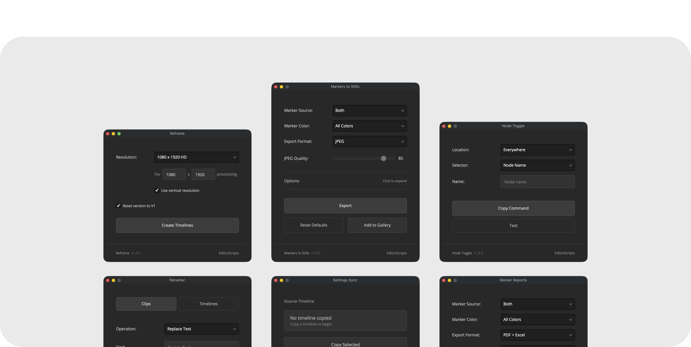

# EditorScripts
A free, open-source toolkit of Lua scripts for **DaVinci Resolve Studio 20+** that streamline workflows for editors and colourists. Drag and Drop install. Every script installs in seconds and runs on Resolve's built-in Lua. No dependencies, no setup.

Created by [Oliwier Gesla](https://oliwiergesla.com.au).

- [Scripts](#scripts)
- [Installation Guide](#installation-guide)
- [Compatibility](#compatibility)
- [License](#license)

### Get the installer from the [latest release](https://github.com/oliwiergesla/editorscripts/releases/latest)

## Scripts

- **Auto In Out** — Set or clear timeline In/Out points automatically.
- **Marker Reports** — Export marker reports as PDF or Excel.
- **Marker Sync** — Copy markers from one timeline to many.
- **Markers to Stills** — Export still frames from markers.
- **Node Toggle** — Toggle color nodes with a Stream Deck.
- **Reframe** — Duplicate selected timelines at a new resolution.
- **Renamer** — Batch rename timelines and clips.
- **Script Launcher** — Launch any Resolve script from a Stream Deck.
- **Settings Sync** — Copy timeline settings from one timeline to many.
- **Version Up** — Duplicate timelines with an incremented version number.

## Installation Guide

Every script ships in one installer file.

1. Download the installer from the [latest release](https://github.com/oliwiergesla/editorscripts/releases/latest).
2. In DaVinci Resolve, open the **Fusion** page.
3. Drag the installer file anywhere into the Fusion page.
4. Click **Install** to get everything — or **Custom Installation** to pick individual scripts.

Once installed, run any script from **Workspace → Scripts → Comp → EditorScripts → _\<Script Name\>_**.

**Updating:** download the latest installer and drag it in again — it updates outdated scripts and skips anything already up to date.

## Compatibility

- **DaVinci Resolve:** **Studio** 20 and newer. The free version of DaVinci Resolve is not supported.
- **Platforms:** macOS, Windows. Linux is untested.

## License

GPL-3.0
