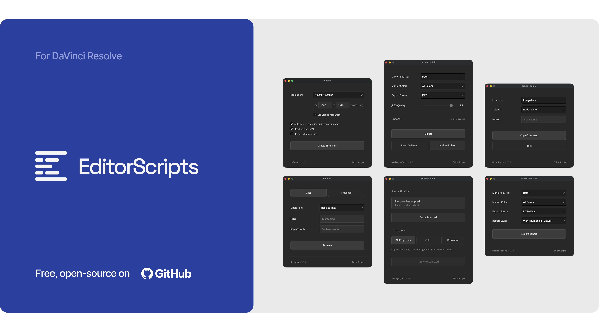

# EditorScripts
A free, open-source toolkit of scripts for **DaVinci Resolve Studio 20+** that streamline workflows for editors and colorists. Drag-and-drop install; every script runs entirely inside Resolve, with nothing else to download or set up.

Created by [Oliwier Gesla](https://oliwiergesla.com.au).

- [Scripts](#scripts)
- [Installation Guide](#installation-guide)
- [Compatibility](#compatibility)
- [License](#license)

### Get the installer from the [latest release](https://github.com/oliwiergesla/editorscripts/releases/latest)

## Scripts

- **[Auto In Out](docs/auto_in_out.md)** — Set or clear timeline In/Out points automatically.
- **[Marker Reports](docs/marker_reports.md)** — Export marker reports as PDF or Excel.
- **[Marker Sync](docs/marker_sync.md)** — Copy markers from one timeline to many.
- **[Markers to Stills](docs/markers_to_stills.md)** — Export still frames from markers.
- **[Node Toggle](docs/node_toggle.md)** — Toggle color nodes with a Stream Deck.
- **[Reframe](docs/reframe.md)** — Duplicate selected timelines at a new resolution.
- **[Renamer](docs/renamer.md)** — Batch rename timelines and clips.
- **[Script Launcher](docs/script_launcher.md)** — Launch any Resolve script from a Stream Deck.
- **[Settings Sync](docs/settings_sync.md)** — Copy timeline settings from one timeline to many.
- **[Version Up](docs/version_up.md)** — Duplicate timelines with an incremented version number.

## Installation Guide

Every script ships in one installer file:

1. Download the installer from the [latest release](https://github.com/oliwiergesla/editorscripts/releases/latest).
2. In DaVinci Resolve, open the **Fusion** page.
3. Drag the installer file anywhere into the Fusion page.
4. Click **Install** to get everything, or **Custom Installation** to pick individual scripts.

> [!NOTE]
> The installer is not a standalone program. Like the scripts it installs, it is a small script file that runs inside Resolve.

**Updating:** download the latest installer and drag it in again; it updates outdated scripts and skips anything already up to date.

Once installed, run any script from **Workspace → Scripts → EditorScripts**. The installer also adds a **Tools** submenu there, with two shortcuts that open the install folders for you: **Open Scripts Folder** and **Open EditorScripts Folder**.

## Compatibility

- **DaVinci Resolve:** **Studio** 20 and newer. The free version of DaVinci Resolve is not supported.
- **Platforms:** macOS, Windows. Linux is untested.

## License

[GPL-3.0](LICENSE) © 2026 Oliwier Gesla
