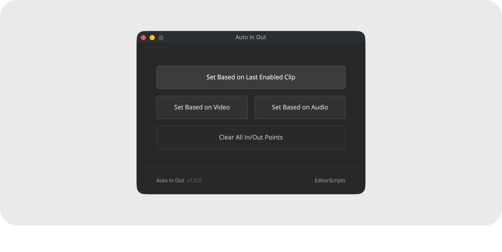

# Auto In Out

Set or clear timeline In/Out points automatically, across as many timelines as you select. The Out point lands exactly on the last frame of the last enabled clip, so renders never include trailing gaps or disabled leftovers.

### What's the point of this?

After finishing an edit, timelines often end up with a pile of leftover disabled clips at the end. This is fine, until you batch add timelines to the render queue, where Resolve defaults to "Entire Timeline" and includes a long black screen at the end of each render.

While manually adding an Out point is trivial on projects with one deliverable, doing this on dozens or hundreds of deliverables takes ages and leaves room for user error. This does it in one click.

- [Installation Guide](#installation-guide)
- [Usage Guide](#usage-guide)
- [Things to Know](#things-to-know)
- [Compatibility](#compatibility)
- [License](#license)

### Get the installer from the [latest release](https://github.com/oliwiergesla/editorscripts/releases/latest)

## Installation Guide

Auto In Out is part of the [EditorScripts](../README.md) toolkit, and every script ships in one installer file:

1. Download the installer from the [latest release](https://github.com/oliwiergesla/editorscripts/releases/latest).
2. In DaVinci Resolve, open the **Fusion** page.
3. Drag the installer file anywhere into the Fusion page.
4. Click **Install** to get everything, or **Custom Installation** to pick individual scripts.

> [!NOTE]
> The installer is not a standalone program. Like the scripts it installs, it is a small script file that runs inside Resolve.

**Updating:** download the latest installer and drag it in again; it updates outdated scripts and skips anything already up to date.

## Usage Guide

Run **Workspace → Scripts → EditorScripts → Auto In Out**, then select one or more timelines in the Media Pool and pick one of four actions:

1. **Set Based on Last Enabled Clip** — the Out point follows whichever enabled clip (video or audio) ends latest.
2. **Set Based on Video** — only video tracks are considered.
3. **Set Based on Audio** — only audio tracks are considered.
4. **Clear All In/Out Points** — removes the In and Out marks from every selected timeline.

## Things to Know

- **Disabled clips never count.** A disabled clip at the end of a timeline never extends the Out point; only enabled clips decide where it lands.

- **The In point is always the timeline start.** The Set actions place the In point on the timeline's first frame; only the Out point depends on your clips.

- **Subtitle tracks are never considered.** Only video and audio tracks are scanned, so a subtitle running past the last clip doesn't move the Out point.

- **Every track of the chosen type is scanned.** The Out point follows whichever clip ends latest across all tracks, not just the first one.

- **The selection is read at click time.** Nothing needs to be selected before launching; the window stays open, so you can change the selection and run another action at any time.

## Compatibility

- **DaVinci Resolve:** **Studio** 20 and newer. The free version of DaVinci Resolve is not supported.
- **Platforms:** macOS, Windows. Linux is untested.

## License

[GPL-3.0](../LICENSE) © 2026 Oliwier Gesla
