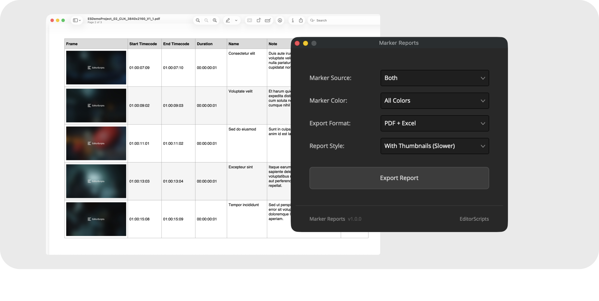

# Marker Reports

Turn your markers into real, actionable notes you can hand to your team or a client: polished PDF reports, or Excel files that import straight into Google Sheets, one per timeline. Every marker lands in a table with timecodes, name, note, color, and an optional frame thumbnail; perfect for client review notes and grading punch lists.

- [Installation Guide](#installation-guide)
- [Usage Guide](#usage-guide)
- [Things to Know](#things-to-know)
- [Compatibility](#compatibility)
- [License](#license)

### Get the installer from the [latest release](https://github.com/oliwiergesla/editorscripts/releases/latest)

## Installation Guide

Marker Reports is part of the [EditorScripts](../README.md) toolkit, and every script ships in one installer file:

1. Download the installer from the [latest release](https://github.com/oliwiergesla/editorscripts/releases/latest).
2. In DaVinci Resolve, open the **Fusion** page.
3. Drag the installer file anywhere into the Fusion page.
4. Click **Install** to get everything, or **Custom Installation** to pick individual scripts.

> [!NOTE]
> The installer is not a standalone program. Like the scripts it installs, it is a small script file that runs inside Resolve.

**Updating:** download the latest installer and drag it in again; it updates outdated scripts and skips anything already up to date.

## Usage Guide

Run **Workspace → Scripts → EditorScripts → Marker Reports**, then select one or more timelines in the Media Pool. The options dialog offers:

1. **Marker Source** — Timeline Markers, Clip Markers, or Both.
2. **Marker Color** — All Colors, or a single marker color to filter by.
3. **Export Format** — PDF + Excel, PDF Only, or Excel Only.
4. **Report Style** — With Thumbnails (Slower) or Text Only (Faster).
5. **Export Report** — pick an output folder and the reports are written, one file set per selected timeline, named after the timeline.

## Things to Know

- **The selection is Media Pool timelines, not the current timeline**, and it is only read when you click **Export Report**; the dialog stays open, so you can change options or selection and export again. Non-timeline items are ignored, and timelines with no matching markers are skipped (noted in Resolve's Console window, under **Workspace → Console**).

- **Clip markers come from video tracks only**, and only from the visible (trimmed) portion of each clip; markers in trimmed-off material are excluded.

- **"Both" keeps one marker per frame.** When a clip marker lands on the same frame as a timeline marker, the timeline marker wins and the clip marker is dropped.

- **Thumbnails are downscaled on macOS only.** Windows embeds frame grabs at full resolution, so thumbnail reports are larger there.

- **A temporary hidden folder appears during export.** A folder named `.report_tmp` holds thumbnail files inside your chosen output folder while the export runs. It cleans itself up, but a crash can leave it behind; it is safe to delete.

- **Thumbnails require moving the playhead.** Resolve can only hand a script the frame under the playhead, so grabbing thumbnails means loading each timeline and stepping the playhead to every marker. Text Only mode skips this and is much faster.

- **Generators and titles don't share their clip markers.** Resolve doesn't give scripts access to markers on generators and titles, so those markers never show up in reports.

## Compatibility

- **DaVinci Resolve:** **Studio** 20 and newer. The free version of DaVinci Resolve is not supported.
- **Platforms:** macOS, Windows. Linux is untested.

## License

[GPL-3.0](../LICENSE) © 2026 Oliwier Gesla
