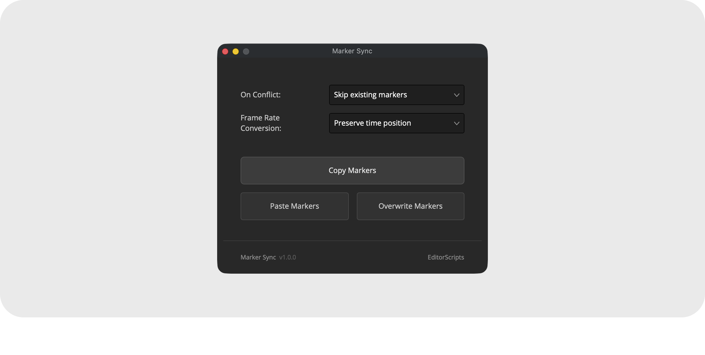

# Marker Sync

Copy all markers from one timeline and paste them onto many others in one go. Conflict handling and frame rate conversion are built in, and your current timeline is never touched.

- [Installation Guide](#installation-guide)
- [Usage Guide](#usage-guide)
- [Things to Know](#things-to-know)
- [Compatibility](#compatibility)
- [License](#license)

### Get the installer from the [latest release](https://github.com/oliwiergesla/editorscripts/releases/latest)

## Installation Guide

Marker Sync is part of the [EditorScripts](../README.md) toolkit, and every script ships in one installer file:

1. Download the installer from the [latest release](https://github.com/oliwiergesla/editorscripts/releases/latest).
2. In DaVinci Resolve, open the **Fusion** page.
3. Drag the installer file anywhere into the Fusion page.
4. Click **Install** to get everything, or **Custom Installation** to pick individual scripts.

> [!NOTE]
> The installer is not a standalone program. Like the scripts it installs, it is a small script file that runs inside Resolve.

**Updating:** download the latest installer and drag it in again; it updates outdated scripts and skips anything already up to date.

## Usage Guide

Run **Workspace → Scripts → EditorScripts → Marker Sync** to open the window, then:

1. **On Conflict** — Skip existing markers, or Overwrite existing when a copied marker lands on an occupied frame.
2. **Frame Rate Conversion** — Preserve time position (markers stay at the same real time position when frame rates differ) or Keep frame numbers.
3. **Copy Markers** — select a single source timeline in the Media Pool and click to copy all of its markers.
4. **Paste Markers** — adds the copied markers to every timeline selected in the Media Pool. **Overwrite Markers** — wipes each destination's existing markers first, then pastes.

## Things to Know

> [!IMPORTANT]
> **No undo.** Overwrite Markers deletes every existing marker on the destination before pasting, immediately and irreversibly. Note the difference from the On Conflict dropdown, which only replaces markers on colliding frames during a normal paste.

- **Frame rate conversion rounds to the nearest frame.** Converting to a lower frame rate can round two source markers onto the same destination frame; the second one fails and is counted as an Error.

- **Copied markers aren't saved.** The copied set is kept only while the window is open, and the dropdowns reset to their defaults on every launch.

- **Markers can land past the end.** Resolve silently accepts markers beyond a timeline's end, so pasting onto a shorter timeline places the extra markers invisibly past its end; they only appear if the timeline is later extended.

## Compatibility

- **DaVinci Resolve:** **Studio** 20 and newer. The free version of DaVinci Resolve is not supported.
- **Platforms:** macOS, Windows. Linux is untested.

## License

[GPL-3.0](../LICENSE) © 2026 Oliwier Gesla
