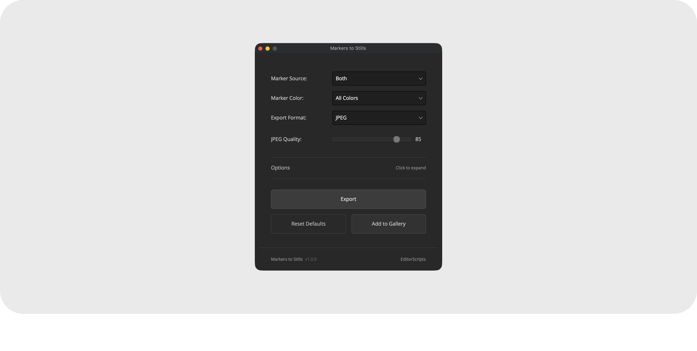

# Markers to Stills

Export a still frame at every marker, across as many timelines as you select. Stills go to disk in your chosen format with fully customizable filenames, or straight into the Color page Gallery.

- [Installation Guide](#installation-guide)
- [Usage Guide](#usage-guide)
- [Things to Know](#things-to-know)
- [Compatibility](#compatibility)
- [License](#license)

### Get the installer from the [latest release](https://github.com/oliwiergesla/editorscripts/releases/latest)

## Installation Guide

Markers to Stills is part of the [EditorScripts](../README.md) toolkit, and every script ships in one installer file:

1. Download the installer from the [latest release](https://github.com/oliwiergesla/editorscripts/releases/latest).
2. In DaVinci Resolve, open the **Fusion** page.
3. Drag the installer file anywhere into the Fusion page.
4. Click **Install** to get everything, or **Custom Installation** to pick individual scripts.

> [!NOTE]
> The installer is not a standalone program. Like the scripts it installs, it is a small script file that runs inside Resolve.

**Updating:** download the latest installer and drag it in again; it updates outdated scripts and skips anything already up to date.

## Usage Guide

Run **Workspace → Scripts → EditorScripts → Markers to Stills**, then select one or more timelines in the Media Pool:

1. **Marker Source** — Timeline Markers, Clip Markers, or Both.
2. **Marker Color** — All Colors, or a single marker color to filter by.
3. **Export Format** — PNG, JPEG, TIFF, DPX, or EXR. On macOS a JPEG quality slider appears when JPEG is selected.
4. **Options** (collapsible) — a filename pattern with token buttons (`{timeline}`, `{marker}`, `{frame}`, `{color}`, `{timecode}`, `{source}`) and a live preview, plus checkboxes for opening the folder after export, creating a subfolder per timeline, and overwriting existing files.
5. **Export** — pick an output folder and the batch runs. **Add to Gallery** instead grabs the stills into the current Gallery album, using your filename pattern as the still label.
6. **Reset** — restores your defaults (the ones you saved, or the built-ins if you never saved any). Hold **Cmd** (macOS) or **Ctrl** (Windows) while clicking to save the current state as your defaults instead, and hold **Cmd+Shift** (macOS) or **Ctrl+Shift** (Windows) to clear your saved defaults and return to the built-ins.

## Things to Know

- **Clip markers come from video tracks only**, and only from the visible (trimmed) portion of each clip.

- **One still per frame.** When "Both" is selected and a clip marker shares a frame with a timeline marker, the timeline marker wins and only one still is exported.

- **JPEG quality is macOS only.** On Windows, JPEG exports always use Resolve's default quality; the slider does not exist there.

- **Canceling keeps partial output.** The progress window's Cancel button stops the batch, but already-exported files (or already-grabbed gallery stills) stay, and in disk mode the output folder still opens if that option is on.

- **Filenames are cleaned up automatically.** Characters that aren't allowed in filenames become underscores, unknown `{tokens}` pass through literally, and name clashes get a numbered suffix unless Overwrite existing files is checked.

- **The selection is read at click time.** Nothing needs to be selected before launching; the dialog stays open for repeat exports and remembers your settings.

- **Before using Add to Gallery, open the Color page and select the destination album.** Stills land in whichever Gallery album is currently selected; the script does not create or switch albums.

- **Exporting moves the playhead.** Resolve can only hand a script the frame under the playhead, so the script must make each timeline current and step the playhead to every marker.

- **Clip markers on generators and titles are skipped.** Resolve gives scripts no way to work out where those markers sit on the timeline, so the script skips them and prints a warning in Resolve's Console window (**Workspace → Console**).

## Compatibility

- **DaVinci Resolve:** **Studio** 20 and newer. The free version of DaVinci Resolve is not supported.
- **Platforms:** macOS, Windows. Linux is untested.

## License

[GPL-3.0](../LICENSE) © 2026 Oliwier Gesla
