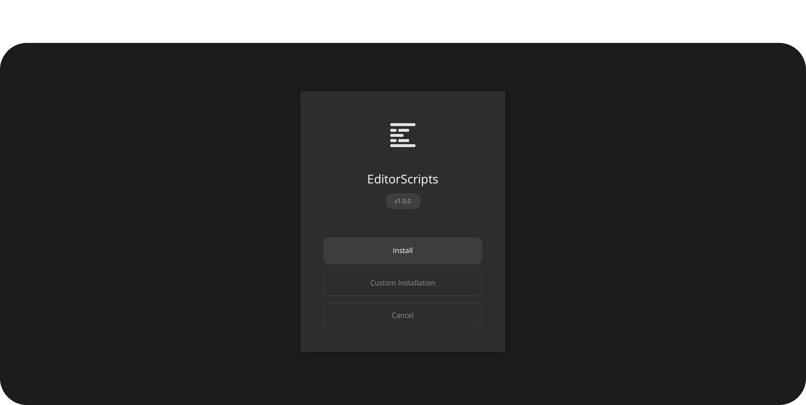

# Node Toggle

Toggle a color node on or off with a Stream Deck button. No need to leave the Edit page or hunt through the node tree. One script serves unlimited buttons.

- [Installation Guide](#installation-guide)
- [Stream Deck Setup](#stream-deck-setup)
- [Functionality](#functionality)
- [Nuances and API Limitations](#nuances-and-api-limitations)
- [Compatibility](#compatibility)
- [License](#license)

### Get the installer from the [latest release](https://github.com/oliwiergesla/editorscripts/releases/latest)



## Installation Guide

Node Toggle is part of the EditorScripts toolkit, and every script ships in one installer file:

1. Download the installer from the [latest release](https://github.com/oliwiergesla/editorscripts/releases/latest).
2. In DaVinci Resolve, open the **Fusion** page.
3. Drag the installer file anywhere into the Fusion page.
4. Click **Install**, or **Custom Installation** to pick individual scripts.

> [!NOTE]
> The installer is not a standalone program. Like the scripts it installs, it is just a Lua script that runs inside Resolve.


## Stream Deck Setup

1. With Resolve open, run **Workspace → Scripts → EditorScripts → Node Toggle**.
2. Pick a location and node, then click **Copy Command** (use **Test** first to confirm it toggles the right node).
3. In the Stream Deck app, add a **System → Open** action to a button and paste into its path field.
   - **macOS:** the clipboard holds a full command (launcher path plus arguments).
   - **Windows:** the clipboard holds the path of a small `.vbs` file generated for that specific button. Paste it **including the quotes**.
4. Press the button. The node toggles; press again to toggle back.

Repeat steps 2-3 for as many buttons as you like.

## Functionality

Node Toggle has two modes: a **setup dialog** you run from inside Resolve, and a **CLI mode** that your Stream Deck buttons trigger.

### Setup dialog

Run the script from Resolve's menu (**Workspace → Scripts**) to open the setup window:

1. **Location** — which node graph(s) to target:
   - **Clip** — the node graph of the clip under the playhead
   - **Pre-clip** / **Post-clip** — the group graphs of that clip's color group
   - **Timeline** — the timeline node graph
   - **Everywhere** — all of the above at once
2. **Selector** — find the node by **Node Name** (exact label match) or **Node Index** (its number in the graph).
3. **Copy Command** — builds the Stream Deck command and copies it to the clipboard.
4. **Test** — runs the exact toggle the copied command will perform.

### How toggling behaves

- When multiple locations are targeted (e.g. Everywhere), the node is toggled in **every graph where it is found**; graphs that don't contain it are skipped. The toggle only fails if the node is found nowhere.
- On the Edit and Cut pages the viewer is automatically refreshed so the change is visible immediately (the Color page updates on its own).
- If a button press fails (Resolve closed, no timeline open, node not found), a native alert pops up explaining why, and the details are written to a log file next to the script (`.data/node_toggle.log`).

### CLI usage

The generated launcher can also be run from a terminal or any other macro tool:

```
node-toggle.sh <positions> <node name or index>
```

- `<positions>` is one of `all`, `clip`, `preclip`, `postclip`, `timeline`, or a comma-separated list (`clip,preclip`).
- Everything after the position is the node name, **no quotes needed**. Spaces are fine: `node-toggle.sh timeline Film Look`.
- A purely numeric value targets the node by index: `node-toggle.sh clip 3`.
- Use `name:2` to target a node literally labelled "2", or `index:2` to force index lookup.

## Nuances and API Limitations

- **On/off state is tracked by the script, not read from Resolve.** The scripting API can't report whether a node is enabled, so Node Toggle tracks the state itself and assumes *enabled* on first use. Toggling the node manually in Resolve's UI drifts the tracked state; one extra button press resyncs it.
- **Commands are per-machine and per-user.** The copied command embeds the script's install path, which lives in your user account. On a new machine or account, rerun the setup dialog and re-copy your buttons.
- **Windows buttons each get their own file.** Stream Deck's Open action on Windows cannot pass arguments, so Copy Command bakes them into a per-button `.vbs`. To change what a button does, re-copy from the setup dialog; stale `.vbs` files are harmless (delete the `.bin` folder next to the script to clean up).
- **Name matching is exact.** The node's label must match what you typed (surrounding whitespace is ignored); if several nodes share the label, the lowest-numbered one wins.
- **Clip, Pre-clip, and Post-clip need a clip under the playhead**, and Pre-/Post-clip additionally require that clip to be assigned to a color group. Positions that don't apply are simply skipped when using Everywhere.
- **Can't target "the selected node" or nodes by color.** The Resolve API exposes neither the current node selection nor node colors, so the node must be identified by name or index.

## Compatibility

- **DaVinci Resolve:** **Studio** 20 and newer. The free version of DaVinci Resolve is not supported.
- **Platforms:** macOS, Windows. Linux is untested.

## License

GPL-3.0
