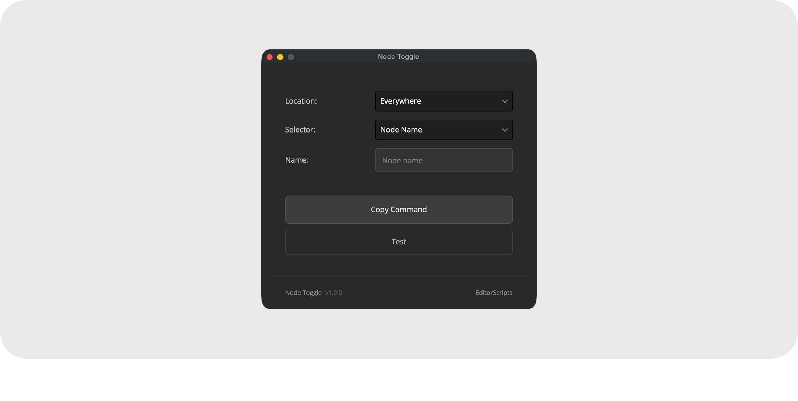
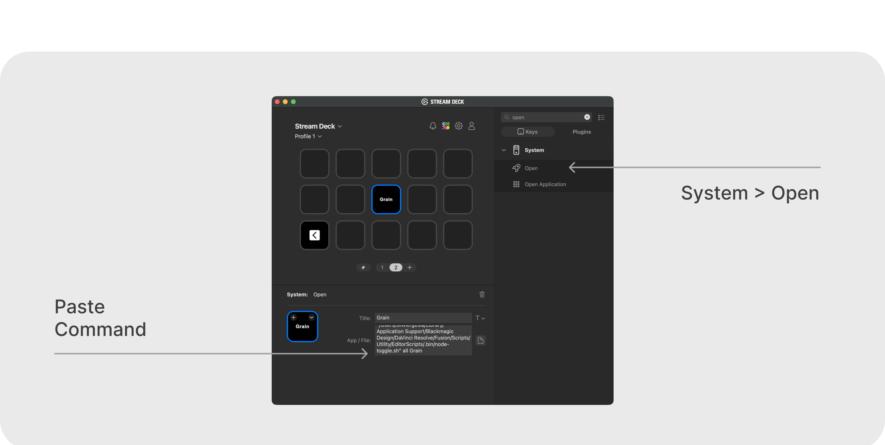

# Node Toggle

Toggle a color node on or off with a Stream Deck button. No need to leave the Edit page or hunt through the node tree. One script serves unlimited buttons. To launch whole scripts from a Stream Deck instead, see [Script Launcher](script_launcher.md).

- [Installation Guide](#installation-guide)
- [Usage Guide](#usage-guide)
- [Stream Deck Setup](#stream-deck-setup)
- [Things to Know](#things-to-know)
- [Advanced](#advanced)
- [Compatibility](#compatibility)
- [License](#license)

### Get the installer from the [latest release](https://github.com/oliwiergesla/editorscripts/releases/latest)


## Installation Guide

Node Toggle is part of the [EditorScripts](../README.md) toolkit, and every script ships in one installer file:

1. Download the installer from the [latest release](https://github.com/oliwiergesla/editorscripts/releases/latest).
2. In DaVinci Resolve, open the **Fusion** page.
3. Drag the installer file anywhere into the Fusion page.
4. Click **Install** to get everything, or **Custom Installation** to pick individual scripts.

> [!NOTE]
> The installer is not a standalone program. Like the scripts it installs, it is a small script file that runs inside Resolve.

**Updating:** download the latest installer and drag it in again; it updates outdated scripts and skips anything already up to date.

## Usage Guide

Run **Workspace → Scripts → EditorScripts → Node Toggle** to open the setup window:

1. **Location** — which node graph(s) to target:
   - **Clip** — the node graph of the clip under the playhead
   - **Pre-clip** / **Post-clip** — the group graphs of that clip's color group
   - **Timeline** — the timeline node graph
   - **Everywhere** — all of the above at once
2. **Selector** — find the node by **Node Name** (exact label match) or **Node Index** (its number in the graph).
3. **Copy Command** — builds the Stream Deck command and copies it to the clipboard.
4. **Test** — runs the exact toggle the copied command will perform.



## Stream Deck Setup

1. With Resolve open, run **Workspace → Scripts → EditorScripts → Node Toggle**.
2. Pick a location and node, then click **Copy Command** (use **Test** first to confirm it toggles the right node).
3. In the Stream Deck app, add a **System → Open** action to a button and paste into its path field.
   - **macOS:** the clipboard holds the full command; paste it as is.
   - **Windows:** the clipboard holds the path of a small helper file (a `.vbs`) created for that specific button. Paste it **including the quotes**.
4. Press the button. The node toggles; press again to toggle back.

Repeat steps 2 and 3 for as many buttons as you like.

## Things to Know

- **Commands are per-machine and per-user.** The copied command points at the script's install location in your user account. On a new machine or account, rerun the setup window and re-copy your buttons.

- **Windows buttons each get their own file.** The Stream Deck app on Windows can't pass extra details along with a button press, so Copy Command saves them into a small per-button file (a `.vbs`). To change what a button does, re-copy from the setup window; leftover files from old buttons are harmless (see [Advanced](#advanced) for cleanup).

- **Name matching is exact.** The node's label must match what you typed (surrounding whitespace is ignored); if several nodes share the label, the lowest-numbered one wins.

- **Clip, Pre-clip, and Post-clip need a clip under the playhead**, and Pre-/Post-clip additionally require that clip to be assigned to a color group. Positions that don't apply are simply skipped when using Everywhere.

- **Multi-location toggles hit every graph where the node is found.** Graphs that don't contain it are skipped; the toggle only fails if the node is found nowhere.

- **The viewer refreshes automatically on the Edit and Cut pages**, so the change is visible immediately (the Color page updates on its own).

- **Failed presses explain themselves.** An alert says why (Resolve closed, no timeline open, node not found), and the details are saved to a log file (see [Advanced](#advanced)).

- **The script keeps track of on/off itself.** Resolve doesn't tell scripts whether a node is currently enabled, so Node Toggle remembers the state on its own and assumes *enabled* on first use. Toggling the node manually in Resolve's UI puts that memory out of step; one extra button press brings it back in sync.

- **It can't target the selected node or a node color.** Resolve doesn't share the current node selection or node colors with scripts, so the node must be identified by name or index.

## Advanced

Nothing in this section is needed for normal Stream Deck use. It is here if you want to trigger toggles from somewhere other than a Stream Deck, such as a macro program or the command line: a Terminal window (macOS) or Command Prompt (Windows).

### Where the launcher lives

Opening the setup window once creates a small launcher file in a hidden folder named `.bin`, next to the installed script:

- **macOS:** `~/Library/Application Support/Blackmagic Design/DaVinci Resolve/Fusion/Scripts/Utility/EditorScripts/.bin/node-toggle.sh` (Finder hides folders that start with a dot; press **Cmd+Shift+.** in the parent folder to reveal it)
- **Windows:** `%APPDATA%\Blackmagic Design\DaVinci Resolve\Support\Fusion\Scripts\Utility\EditorScripts\.bin\node-toggle.vbs` (paste the path into File Explorer's address bar; your buttons' per-button `node-toggle-*.vbs` files live in the same folder)

Deleting the whole `.bin` folder is a safe way to clean up old button files; re-copying a command recreates whatever is needed.

### Running it yourself

Both files take the same two pieces of information (examples below use the macOS name; on Windows swap in `node-toggle.vbs`):

```
node-toggle.sh <positions> <node name or index>
```

- `<positions>` is one of `all`, `clip`, `preclip`, `postclip`, `timeline`, or a comma-separated list (`clip,preclip`).
- Everything after the position is the node name, **no quotes needed**. Spaces are fine: `node-toggle.sh timeline Film Look`.
- A purely numeric value targets the node by its number in the graph: `node-toggle.sh clip 3`.
- Use `name:2` to target a node literally labeled "2", or `index:2` to force lookup by number.

### Logs

Every press is logged to `node_toggle.log` in a hidden `.data` folder next to the installed script; that is where the details behind a failure alert end up.

## Compatibility

- **DaVinci Resolve:** **Studio** 20 and newer. The free version of DaVinci Resolve is not supported.
- **Platforms:** macOS, Windows. Linux is untested.

## License

[GPL-3.0](../LICENSE) © 2026 Oliwier Gesla
