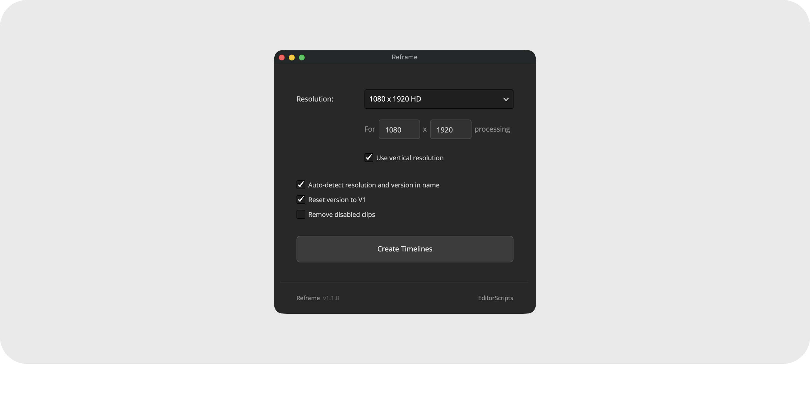

# Reframe

Duplicate selected timelines at a new resolution in one batch. Pick from a Resolve-style preset list or type a custom size, and every copy comes out cleanly renamed with your color settings intact.

- [Installation Guide](#installation-guide)
- [Usage Guide](#usage-guide)
- [Things to Know](#things-to-know)
- [Compatibility](#compatibility)
- [License](#license)

### Get the installer from the [latest release](https://github.com/oliwiergesla/editorscripts/releases/latest)

## Installation Guide

Reframe is part of the [EditorScripts](../README.md) toolkit, and every script ships in one installer file:

1. Download the installer from the [latest release](https://github.com/oliwiergesla/editorscripts/releases/latest).
2. In DaVinci Resolve, open the **Fusion** page.
3. Drag the installer file anywhere into the Fusion page.
4. Click **Install** to get everything, or **Custom Installation** to pick individual scripts.

> [!NOTE]
> The installer is not a standalone program. Like the scripts it installs, it is a small script file that runs inside Resolve.

**Updating:** download the latest installer and drag it in again; it updates outdated scripts and skips anything already up to date.

## Usage Guide

Run **Workspace → Scripts → EditorScripts → Reframe**, then select one or more timelines in the Media Pool:

1. **Resolution** — a preset dropdown mirroring Resolve's own timeline-format list (HD, Ultra HD, DCI, vertical formats, and more). Picking a preset fills the width and height fields; editing either field switches to Custom.
2. **Use vertical resolution** — swaps width and height and switches to the vertical preset list, just like Resolve's own checkbox. On by default.
3. **Auto-detect resolution and version in name** — recognizes trailing `_<width>x<height>` and `_V<number>` suffixes so they can be replaced. When off, the name is left untouched, the new resolution is simply appended, and the version checkbox is disabled. On by default.
4. **Reset version to V1** — names the new timelines with a fresh `_V1` suffix; when unchecked, the existing version suffix is kept. On by default.
5. **Remove disabled clips** — deletes disabled video and audio clips from each duplicate. Off by default.
6. **Create Timelines** — duplicates every selected timeline at the chosen resolution while a progress window tracks the batch.

## Things to Know

- **Duplicates are renamed automatically.** With auto-detect on, old suffixes are swapped for new ones: `YourTimeline_3840x2160_V2` at 1080x1920 becomes `YourTimeline_1080x1920_V1` (or `_V2` with **Reset version to V1** off). Originals are never touched. To bump a timeline's version without changing resolution, see [Version Up](version_up.md).

- **Only trailing suffixes are recognized.** `_V<number>` and `_<width>x<height>` are replaced only at the end of a name (in either order); the same patterns mid-name are left alone. Zero padding and case survive when the version is kept (`V03` stays `V03`).

- **Name collisions are caught up front.** Every target name is checked against the project before anything is created; a warning offers the next available version for any that exist, and canceling aborts the whole batch.

- **Color settings survive the switch to Custom Timeline Settings.** Duplicating at a new resolution forces custom timeline settings, which normally resets color management; Reframe re-applies the inherited project settings to each duplicate.

- **The selection is read at click time.** Nothing needs to be selected before launching, and the dialog stays open for another batch.

- **Frame rate is never copied or changed.** Resolve doesn't let scripts write frame-rate settings at all, so duplicates keep their source frame rate.

- **Output color space and gamma can't always carry over.** When a timeline uses "separate color space and gamma", Resolve refuses the script's writes to the output color settings; the script skips them and notes it in Resolve's Console window (**Workspace → Console**).

- **Remove disabled clips switches timelines.** Resolve only lets scripts delete clips on the current timeline, so with this option on, each duplicate that actually contains disabled clips is briefly made current.

## Compatibility

- **DaVinci Resolve:** **Studio** 20 and newer. The free version of DaVinci Resolve is not supported.
- **Platforms:** macOS, Windows. Linux is untested.

## License

[GPL-3.0](../LICENSE) © 2026 Oliwier Gesla
