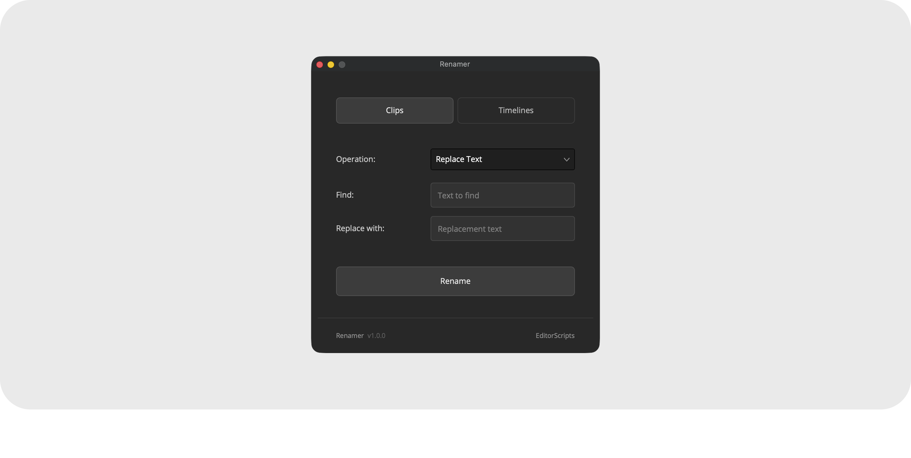

# Renamer

Batch rename timelines and clips in the Media Pool. Find and replace, add text, build names from tokens with a live preview, or reset clips to their source filenames, with a one-click undo.

- [Installation Guide](#installation-guide)
- [Usage Guide](#usage-guide)
- [Things to Know](#things-to-know)
- [Compatibility](#compatibility)
- [License](#license)

### Get the installer from the [latest release](https://github.com/oliwiergesla/editorscripts/releases/latest)

## Installation Guide

Renamer is part of the [EditorScripts](../README.md) toolkit, and every script ships in one installer file:

1. Download the installer from the [latest release](https://github.com/oliwiergesla/editorscripts/releases/latest).
2. In DaVinci Resolve, open the **Fusion** page.
3. Drag the installer file anywhere into the Fusion page.
4. Click **Install** to get everything, or **Custom Installation** to pick individual scripts.

> [!NOTE]
> The installer is not a standalone program. Like the scripts it installs, it is a small script file that runs inside Resolve.

**Updating:** download the latest installer and drag it in again; it updates outdated scripts and skips anything already up to date.

## Usage Guide

Run **Workspace → Scripts → EditorScripts → Renamer**, then select items in the Media Pool:

1. **Clips / Timelines** — a mode toggle; mixed selections are fine, only items of the active type are processed.
2. **Operation:**
   - **Replace Text** — literal find and replace across every occurrence in the name.
   - **Add Text** — appends or prepends text to the existing name.
   - **Format** — rebuilds names from a token pattern with a live preview. Tokens: `{name}`, `{counter}`, `{index}`, `{date}`, `{resolution}`, `{framerate}`, and for clips `{extension}`; buttons insert them at the cursor.
   - **Set to Filename** (clips only) — renames each clip to its source file's name, extension included.
3. **Clone with new name** (timelines only) — duplicates each timeline under the new name and leaves the originals untouched.
4. **Rename** — runs the batch; an **Undo** button appears afterwards to restore the previous names.

## Things to Know

> [!IMPORTANT]
> **Files on disk are never touched.** Renaming changes Media Pool names only.

- **Undo is one level and rename-only.** Each batch overwrites the previous undo, clones and Set to Filename are not undoable, and switching between Clips and Timelines discards the pending undo.

- **Timeline name conflicts stop the batch; clip conflicts only warn.** Duplicate clip names get a Continue/Cancel warning; a timeline rename that would collide with an existing timeline stops the whole batch and lists every conflict in Resolve's Console window (**Workspace → Console**).

- **`{counter}` adds leading zeros to match the batch size.** Twelve items count 01 to 12.

- **`{date}` falls back silently.** It uses the clip's Date Created property; when that is missing or in an unrecognized format, today's date is substituted without warning.

- **Names aren't validated.** Any characters pass through, and nothing stops a replace from leaving a name empty.

- **Set to Filename skips generated media.** Titles, generators, and anything without a file path are counted as skipped, as are clips already named after their file.

- **Results appear in the Console, not a popup.** The dialog stays open with no success message; the per-item report and summary are printed to the Console.

## Compatibility

- **DaVinci Resolve:** **Studio** 20 and newer. The free version of DaVinci Resolve is not supported.
- **Platforms:** macOS, Windows. Linux is untested.

## License

[GPL-3.0](../LICENSE) © 2026 Oliwier Gesla
