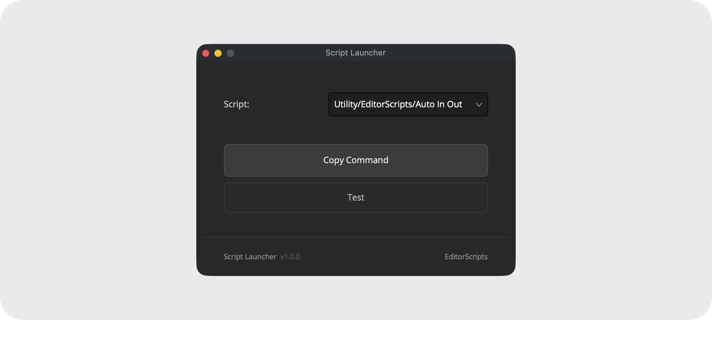

# Script Launcher

Launch any Resolve script from a Stream Deck key. One installed launcher serves unlimited buttons; each button just names the script it should start, so your buttons keep working through reinstalls and updates. To toggle color nodes from a Stream Deck instead, see [Node Toggle](node_toggle.md).

- [Installation Guide](#installation-guide)
- [Usage Guide](#usage-guide)
- [Stream Deck Setup](#stream-deck-setup)
- [Things to Know](#things-to-know)
- [Advanced](#advanced)
- [Compatibility](#compatibility)
- [License](#license)

### Get the installer from the [latest release](https://github.com/oliwiergesla/editorscripts/releases/latest)


## Installation Guide

Script Launcher is part of the [EditorScripts](../README.md) toolkit, and every script ships in one installer file:

1. Download the installer from the [latest release](https://github.com/oliwiergesla/editorscripts/releases/latest).
2. In DaVinci Resolve, open the **Fusion** page.
3. Drag the installer file anywhere into the Fusion page.
4. Click **Install** to get everything, or **Custom Installation** to pick individual scripts.

> [!NOTE]
> The installer is not a standalone program. Like the scripts it installs, it is a small script file that runs inside Resolve.

**Updating:** download the latest installer and drag it in again; it updates outdated scripts and skips anything already up to date.

## Usage Guide

Run **Workspace → Scripts → EditorScripts → Script Launcher** to open the setup window:

1. **Script** — the dropdown lists **every script installed in Resolve's Scripts folders**, not just EditorScripts, so anything you can run from the Workspace menu can live on a button. The list is sorted, shows each script's folder for context, and remembers your last pick.
2. **Copy Command** — builds the Stream Deck command and copies it to the clipboard.
3. **Test** — runs the real launcher exactly the way a button press will.


## Stream Deck Setup

1. With Resolve open, run **Workspace → Scripts → EditorScripts → Script Launcher**.
2. Pick a script from the dropdown and click **Copy Command** (use **Test** first; it runs the real launcher exactly the way a button press will).
3. In the Stream Deck app, add a **System → Open** action to a button and paste into its path field.
   - **macOS:** the clipboard holds the full command; paste it as is.
   - **Windows:** the clipboard holds the path of a small helper file (a `.vbs`) created for that specific button. Paste it **including the quotes**.
4. Press the button; the script starts in Resolve.

Repeat steps 2 and 3 for as many buttons as you like.

## Things to Know

- **Commands are per-machine and per-user.** Installs land in your user account's scripts folder. On a new machine or account, open Script Launcher once from the Workspace menu (that alone reinstalls the launcher) and re-copy your buttons.

- **Windows buttons each get their own file.** The Stream Deck app on Windows can't pass extra details along with a button press, so Copy Command saves the script's name into a small per-button file (a `.vbs`). Leftover files from old buttons are harmless (see [Advanced](#advanced) for cleanup).

- **On Windows, a script can only be launched once at a time.** Pressing a button for a script whose window is already open shows a "may already be open" alert instead of starting a second copy; close the script's window to relaunch. macOS has no such lock and will happily open a second copy.

- **Resolve must be running** and installed in its default location; the launcher finds Resolve's scripting engine at the standard install path on both platforms.

- **Same-named scripts are told apart automatically.** If two installed scripts share a filename, their button names include the parent folder. If your set of installed scripts differs between machines, such a button may need re-copying on the other machine.

- **Buttons store the script's name, not its file path.** Each press looks the name up fresh against whatever is installed at that moment, so buttons survive script updates, reinstalls, and scripts moving between folders.

- **Failed presses explain themselves.** An alert says why (Resolve closed, script uninstalled or renamed), even when Resolve is closed, and the details are saved to a log file (see [Advanced](#advanced)).

- **Launched scripts can't print to Resolve's Console.** They run behind the scenes, outside Resolve's own window, so their output is captured to a log file instead (see [Advanced](#advanced)).

## Advanced

Nothing in this section is needed for normal Stream Deck use. It is here if you want to launch scripts from somewhere other than a Stream Deck, such as a macro program or the command line: a Terminal window (macOS) or Command Prompt (Windows).

### Where the launcher lives

Opening the setup window once creates a small launcher file in a hidden folder named `.bin`, next to the installed script:

- **macOS:** `~/Library/Application Support/Blackmagic Design/DaVinci Resolve/Fusion/Scripts/Utility/EditorScripts/.bin/script-launcher.sh` (Finder hides folders that start with a dot; press **Cmd+Shift+.** in the parent folder to reveal it)
- **Windows:** `%APPDATA%\Blackmagic Design\DaVinci Resolve\Support\Fusion\Scripts\Utility\EditorScripts\.bin\script-launcher.vbs` (paste the path into File Explorer's address bar; your buttons' per-button `script-launcher-*.vbs` files live in the same folder)

Deleting the whole `.bin` folder is a safe way to clean up old button files; re-copying a command recreates whatever is needed.

### Running it yourself

Both files take the script's short name (examples below use the macOS name; on Windows swap in `script-launcher.vbs`):

```
script-launcher.sh <short-name>
```

- The short name is the script's filename in lowercase, with hyphens in place of spaces and punctuation: `script-launcher.sh markers-to-stills` launches `Markers to Stills.lua`.
- The setup window builds short names for you: on macOS it is the last word of the copied command; on Windows it is the tail of the per-button `script-launcher-<short-name>.vbs` filename.
- If two installed scripts share a filename, one of the short names includes its parent folder; use **Copy Command** to see the exact one.
- The short name is looked up fresh on every run, so commands keep working after script updates and reinstalls.

### Logs

Two log files live in a hidden `.data` folder next to the installed script:

- **`script_launcher.log`** — the launcher's own history, which is where the details behind a failure alert end up. It is trimmed automatically so it never grows large.
- **`script_launcher_target.log`** — the output of whatever script you launched, kept for the latest run only.

## Compatibility

- **DaVinci Resolve:** **Studio** 20 and newer. The free version of DaVinci Resolve is not supported.
- **Platforms:** macOS, Windows. Linux is untested.

## License

[GPL-3.0](../LICENSE) © 2026 Oliwier Gesla
