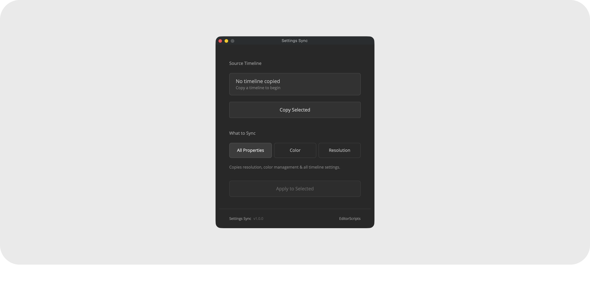

# Settings Sync

Copy timeline settings from one timeline and apply them to many. Standardize resolution, color management, or everything at once across a whole batch of timelines in two clicks.

- [Installation Guide](#installation-guide)
- [Usage Guide](#usage-guide)
- [Things to Know](#things-to-know)
- [Compatibility](#compatibility)
- [License](#license)

### Get the installer from the [latest release](https://github.com/oliwiergesla/editorscripts/releases/latest)

## Installation Guide

Settings Sync is part of the [EditorScripts](../README.md) toolkit, and every script ships in one installer file:

1. Download the installer from the [latest release](https://github.com/oliwiergesla/editorscripts/releases/latest).
2. In DaVinci Resolve, open the **Fusion** page.
3. Drag the installer file anywhere into the Fusion page.
4. Click **Install** to get everything, or **Custom Installation** to pick individual scripts.

> [!NOTE]
> The installer is not a standalone program. Like the scripts it installs, it is a small script file that runs inside Resolve.

**Updating:** download the latest installer and drag it in again; it updates outdated scripts and skips anything already up to date.

## Usage Guide

Run **Workspace → Scripts → EditorScripts → Settings Sync** to open the window, then:

1. **Copy Selected** — select a single source timeline in the Media Pool and click to copy its settings. The source card shows what you grabbed: name, resolution, and color science at a glance.
2. **What to Sync** — pick the scope with a three-way toggle:
   - **All Properties** — resolution, color management, and all other timeline settings.
   - **Color** — color science, timeline, and output color space settings only.
   - **Resolution** — timeline width and height only.
3. **Apply to Selected** — select one or more target timelines in the Media Pool and click to apply.

## Things to Know

> [!IMPORTANT]
> **No undo.** Applied settings replace whatever the targets had; there is no way to restore their previous state afterwards.

- **Copy once, apply many.** Copying captures the full settings set and What to Sync filters at apply time, so you can apply different subsets to different selections without recopying.

- **"Use Project Settings" only carries over in All Properties mode.** If the source timeline follows the project settings, All Properties sets the targets to follow them too. Color and Resolution modes must write explicit values, so they untick "Use Project Settings" on each target, even when the source had it on.

- **Selection is Media Pool timelines at click time**, not the currently open timeline. Copy requires exactly one selected; Apply accepts many. Nothing stops you from including the source in the target selection (it's harmless).

- **Copied settings aren't saved.** Closing the window discards them, and no preferences are saved between runs.

- **Frame rate cannot be synced.** Resolve refuses to let scripts write frame-rate settings on timelines with content, so those keys are filtered out at copy time; a note in Resolve's Console window (**Workspace → Console**) says how many.

- **"Separate color space and gamma" blocks two keys.** When the source uses that mode, Resolve won't let scripts write output color space and output gamma to targets. The script warns you at copy time and skips those two keys at apply time; everything else copies correctly.

## Compatibility

- **DaVinci Resolve:** **Studio** 20 and newer. The free version of DaVinci Resolve is not supported.
- **Platforms:** macOS, Windows. Linux is untested.

## License

[GPL-3.0](../LICENSE) © 2026 Oliwier Gesla
